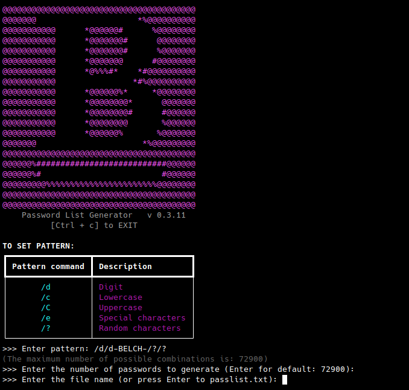

<p align="center"></p>

  


# BELCH Password List Generator

BELCH Password List Generator is a simple tool to generate password lists based on a given pattern. You can specify the password pattern and generate multiple unique passwords.

## Installation

### Install usig PIP:

   ```bash
   pip install belch 
   ```


## Usage
To generate passwords, run the following command from anywhere on your system:
 
    belch 
    

Follow the on-screen instructions to specify the password pattern and the number of passwords to generate.

<p align="center"></p>

## Password Patterns
You can use the following characters in your pattern:

- /d : Digit
- /c : Lowercase
- /C : Uppercase
- /e: Special characters
- /? : Random characters

For example, the pattern [/C/c-pass-/d/?] will generate passwords with a combination of uppercase, lowercase, digits, and random characters in specified order.

## License
This project is licensed under the GNU-GPL License. See the LICENSE file for more details.
